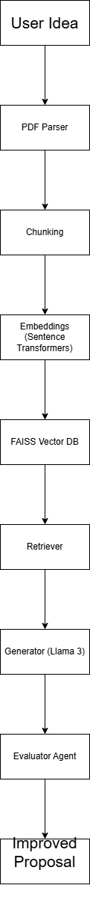

# AI-Based Research Grant Proposal Generator & Evaluator
An AI-powered system that automates funding guideline interpretation,
proposal drafting, budget planning, and rubric-based evaluation using
RAG (Retrieval-Augmented Generation) and multi-agent architecture.

Built using Llama 3 (local), FAISS vector search, and Streamlit.

# Features
- 📄 Funding guideline parsing (PDF)
- 🔎 RAG-based intelligent retrieval
- 📝 Structured proposal generation
- 💰 Budget & timeline estimation
- 📊 Rubric-based scoring system
- 🔁 Automated critique loop
- 🌐 Streamlit UI interface

# Project Structure

# Installation Guide
### 1. Clone repository
git clone https://github.com/yourusername/ai-grant-proposal-generator.git

### 2. Create virtual environment
python -m venv venv

### 3. Activate
venv\Scripts\activate

### 4. Install dependencies
pip install -r requirements.txt

### 5. Install Ollama
https://ollama.com

### 6. Pull model
ollama pull llama3

### 7. Run app
streamlit run app.py

# Why This Project Matters
- Reduces faculty workload
- Increases funding success probability
- Demonstrates advanced RAG architecture
- Multi-agent AI design
